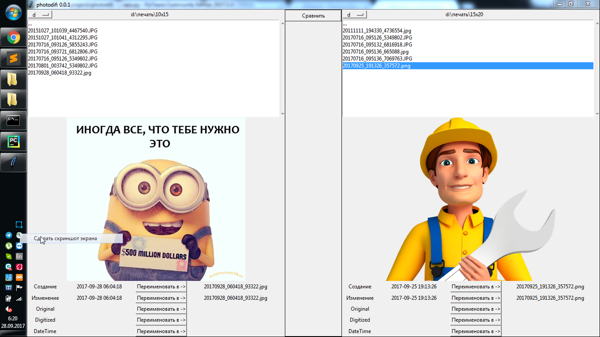

# photodif

Разрабатывалась для синхронизации каталога с файлами.

Первоначальная цель, синхронизация каталога с семейными фотографиями и видео.

Т.е. у меня имеется на двух жестких дисках каталог с фотографиями и видео, одна из них должна быть абсолютной копией. 

Но могут возникнуть такие ситуации, что в какой-то из каталогов может появиться что-то новое или что-то пропасть.

## 2017.09.28 - 0.0.1

умеет

* отображать каталоги
* сравнивать по размеру каталогов 
* переименовывать фотографии по дате